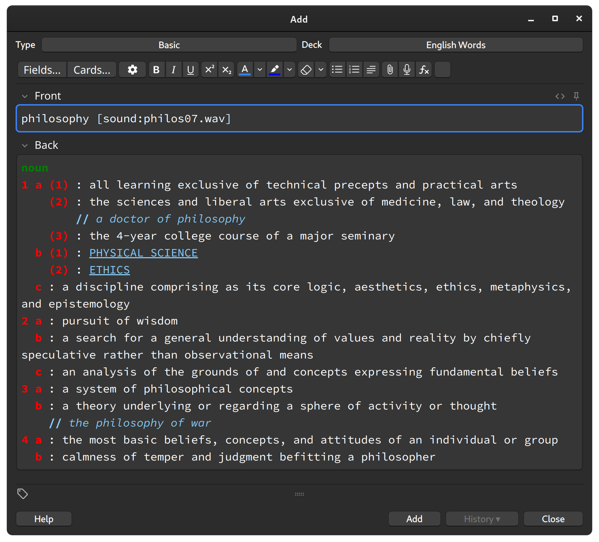

# Anki M-W Definition Add-on

This is an Anki add-on that automatically pulls word definitions from Merriam-Webster's Collegiate® Dictionary with Audio using its JSON API: https://dictionaryapi.com/products/api-collegiate-dictionary.



The project was heavily inspired by AutoDefine (https://github.com/z1lc/AutoDefine). I decided to make a new add-on so I can achieve the following goals:

1. formatting word definitions close to the Merriam-Webster website
2. color-coding and proper indentation to make reading easier
3. adopting the M-W JSON API for future proof

Compared to AutoDefine, this add-on lacks support for the Merriam-Webster Medical Dictionary, because I don't personally use it, therefore won't be able to test. It's very weak on error-handling or UX, because my priorities at this stage are for personal uses.

## Usage

Install the add-on to Anki. For Linux, the path is `~/.local/share/Anki2/addons21/`.

```
git clone https://github.com/telotic/AnkiMWDefine.git ~/.local/share/Anki2/addons21/AnkiMWDefine
```

Make sure to have API key (register on https://www.dictionaryapi.com/) stored in `config.json` file:

```json
{
    "api_key": "YOUR_MW_DICTIONARY_API_KEY"
}
```

When in the card editor, type the word in the "Front" text section, and then click the icon on the toolbar. The word definition will be added to the "Back" text section.

## Testing

Run shell command to print result for the word to look up:

```bash
$ python define.py monitor
```
